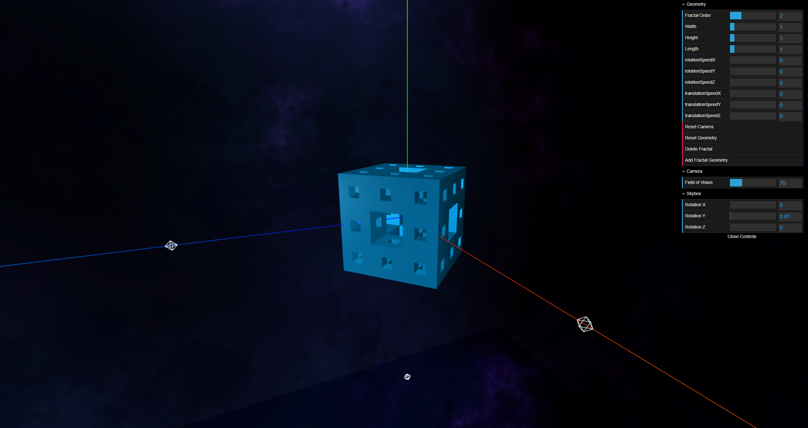

# 3D Fractal Visualiser
<b>Author:</b> Ilmar Uduste
 <b>Course:</b> Computer Graphics, PGRe, Brno University of Technology

This is an interactive 3D application made in WebGL to visualize a typical [Menger Sponge](https://en.wikipedia.org/wiki/Menger_sponge) fractal. [The app is usable on Github Pages](https://ilmaruduste.github.io/3DFractalVisualizer/), so feel free to explore around and take inspiration!

The application itself looks like the picture above and it runs off your graphics card in a web browser. To run it locally, you just have to clone the repository and open index.html in a browser, although it then won't open the skybox textures correctly (CORS issue).

<b>NB!</b> The algorithm in use for generating the fractals isn't very efficient, though, so generating fractals with order n > 3 is most likely going to crash the application.

# Instructions
<b>Camera:</b> Movable with the mouse/trackpad. Field of Vision can be changed in the GUI. 
<b>Zoom:</b> Use the scroll wheel to zoom in or out. 
<b>GUI:</b> Open the GUI via the "Open Controls" button on the right side. 
<b>Geometry:</b> Use the options in the Geometry menu in the GUI to change geometry settings, like rotation, translation etc. To generate a new geometry with a different fractal order, first press Delete Fractal and then Add Fractal Geometry. 
<b>Skybox:</b> Rotation can be added to the skybox to make it seem like a moving scene.
